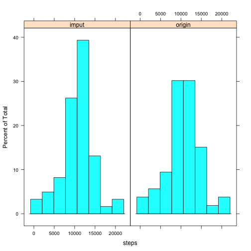
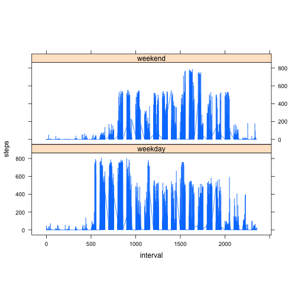

# Reproducible Research: Peer Assessment 1
This research would load a personal movement dataset and analyze the characteristic of the data.

## Loading and preprocessing the data

The data would be loaded from the downloaded file.


```r
unzip("activity.zip")
data <- read.csv("activity.csv")
```

## What is mean total number of steps taken per day?

The data could be aggregated for each day to get the total steps for each day. And a histogram could be plotted to demonstrate each day's total steps.


```r
daily <- aggregate(steps ~ date, data=data, sum)
hist(daily$steps)
```

 

The mean and medien for each day's total steps could be calculated.

* mean: 10766.19
* median: 10765

## What is the average daily activity pattern?

For a day, if we want to do analysis on activity pattern for different interval, we could aggregate data based on interval. And plot the steps over interval.


```r
interval <- aggregate(steps~interval, data=data,sum)
plot(interval$interval,interval$steps, type="l",xlab="Interval",ylab="Total number of Steps")
```

 

The interval with maximum steps in a day could be searched in the data frame with below code:


```r
interval[which.max(interval$steps),"interval"]
```

```
## [1] 835
```

## Imputing missing values
Calculate the total rows with a missing steps data:


```r
nrow(data[is.na(data$steps),])
```

```
## [1] 2304
```

Add the mean value into the the dataset in the place of missing values. After imput missing data with mean data, the distribution of the freqency looks similar, as we can see in the plot.


```r
interval_mean <- aggregate(steps~interval, data=data,mean)
data_filled_mean <- merge(data,interval_mean,by.x="interval",by.y="interval")
data_filled_mean[is.na(data_filled_mean$steps.x),"steps.x"] <- data_filled_mean[is.na(data_filled_mean$steps.x),"steps.y"]
data_filled_mean <- data_filled_mean[-4]
colnames(data_filled_mean) <- c("interval","steps","date")
daily_filled_mean <- aggregate(steps ~ date, data=data_filled_mean, sum)
hist(daily_filled_mean$steps)
```

 

While the distribution looks similar, but it is different from the origin data. We can find out with a comparison plot.


```r
daily_filled_mean <- cbind(daily_filled_mean,c("imput"))
colnames(daily_filled_mean)[3] <- "type"
daily <- cbind(daily,c("origin"))
colnames(daily)[3] <- "type"
daily_merged <- rbind(daily_filled_mean, daily)
library(lattice)
histogram(~steps|type,data=daily_merged)
```

 

And the mean is the same, but meadian has changed.

* mean: 10766.19
* median: 10766.19

## Are there differences in activity patterns between weekdays and weekends?

To understand the differences in activity patterns between weekdays and weekends, we would add a new column in the data frame. And plot it to show the difference. From the plot, there are more movements in weekdays.


```r
checkWeekend <- function(weekday){ 
        if(weekday=="Sunday" | weekday=="Saturday") { "weekend"}
        else{"weekday"}}
data_weekday <- cbind(data_filled_mean,weekdays(as.Date(data_filled_mean$date)))
colnames(data_weekday)[4] <- "weekday"
data_weekday$weekday <- sapply(data_weekday$weekday,checkWeekend)
xyplot(steps~interval | weekday, data=data_weekday, type="l", aspect="iso")
```

 


